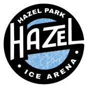

  

<h1 align="center">Viking Arena Time Card</h1>

  <strong>Workflow-driven scheduling and timekeeping software built around the day-to-day operations of an ice arena.</strong>

## Overview

Viking Arena Time Card replaces fragmented employee scheduling and timekeeping workflows with a role-aware system for shift scheduling, hour submission, work-history tracking, and manager oversight.

The project began with the actual workflow of an operating ice arena: employees working different roles and shifts, managers coordinating coverage, staff recording hours, and work history needing to remain accessible and organized.

Rather than beginning with a technology stack, the application is designed around how the work actually happens.

## The Workflow Problem

Ice arena staffing involves several connected processes:

* Employees need a simple way to access their own work information.
* Managers need to schedule employees across different roles and shifts.
* Staff need to record hours worked.
* Work history needs to persist and remain accessible.
* Different users require different levels of access.
* Scheduling and timekeeping information needs to remain connected rather than scattered across separate processes.

Viking Arena Time Card brings those activities into one system.

## Workflow

The application is organized around two primary users.

### Employees

Employees can:

* Authenticate using their individual credentials.
* View information relevant to their role.
* Record and review hours worked.
* Access their work history.
* View scheduling information.

### Managers

Managers can:

* Authenticate with manager-level access.
* Create and manage employee schedules.
* Coordinate staffing across arena roles.
* Review employee work history.
* Maintain visibility into scheduling and timekeeping activity.

## System Design

The application separates the user interface from backend services and persistent data storage.

The system includes:

* Role-aware authentication and authorization
* Employee and manager workflows
* Shift scheduling
* Time-entry management
* Persistent work-history records
* REST API communication between frontend and backend
* Responsive interfaces designed for both desktop and mobile use

The goal is not simply to digitize a time card. It is to model the operational relationship between employees, schedules, hours, roles, and management oversight.

## Engineering Approach

Development is centered on the workflow first.

Each technical decision is evaluated against questions such as:

* Who needs access to this information?
* What actions should each role be allowed to perform?
* What information needs to persist?
* Where can scheduling or timekeeping errors occur?
* How should the frontend communicate with the underlying data?
* How can the system remain straightforward for employees with different levels of technical comfort?

This approach keeps the application architecture tied to the real operational problem it is intended to solve.

## Architecture

The system follows a client/server architecture:

**Frontend → REST API → Application Logic → Database**

The frontend provides the employee and manager interfaces.

The backend handles authentication, business logic, scheduling, employee data, and work-history operations.

Persistent database storage allows employee and scheduling information to survive beyond individual browser sessions.

## Technology

* JavaScript
* Node.js
* Express
* PostgreSQL
* REST APIs
* HTML
* CSS
* Git / GitHub

## Current Development

Viking Arena Time Card remains under active development.

Current work is focused on strengthening the production-oriented backend, persistent PostgreSQL data storage, authentication and authorization controls, and continued refinement of the employee and manager experience.

## Project Principle

> **Start with the workflow. Build the software around it.**

Viking Arena Time Card demonstrates an approach to software development centered on understanding an existing operational process and turning that process into a maintainable software system.

---

© 2026 CourDevelops. All rights reserved.

Source code is publicly available for portfolio and demonstration purposes. This project is not open source.
